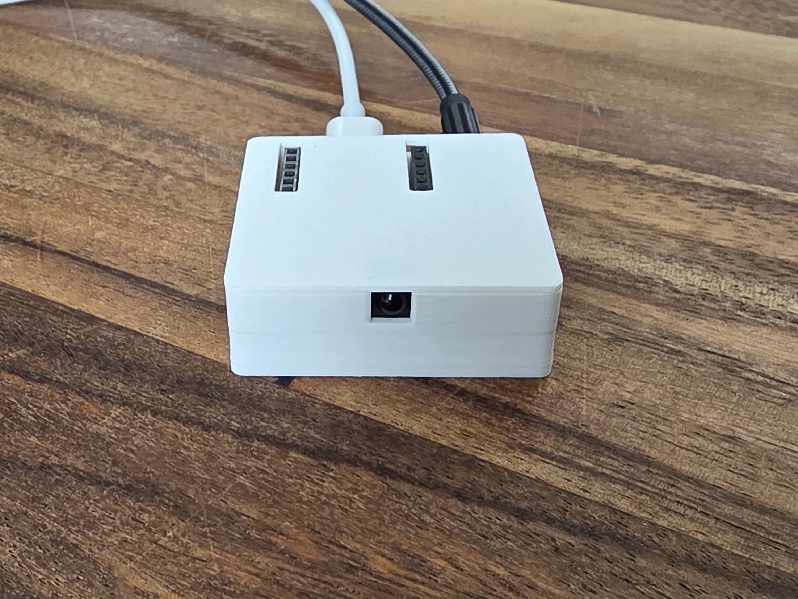

## Description

Any speaker with a 3.5mm input can join your smart home. The Apollo CAST-1 plugs into powered speakers, a hi-fi
amplifier, an AV receiver, or a pair of desktop monitors and turns them into a network audio player. They show up in
ESPHome as a media player and also use SendSpin to connect to Music Assistant!

**Perfect for:**

- Whole home audio
- Syncing audio between rooms
- Turn your non-smart speaker smart
- Play alarms, chimes, notifications to a speaker from Home Assistant or ESPHome

## Technical Specifications

- **LEDs**: Onboard RGB LED, also a hookup to connect your own RGB strip!
- **Modular Attachments**:
  - Top: Ethernet connector
- **Power**: USB-C
- **Connectivity**: Wi-Fi or ethernet
- **Board**: ESP32-based

## Quickstart

1. Connect the CAST-1 via USB-C or power on with battery.
2. Connect to "Apollo CAST1 Hotspot".
3. Input WiFi credentials.
4. In Home Assistant, look at discovered devices.
5. Customize button functions and add modular attachments as needed.

## Configuration

```yaml url=https://github.com/ApolloAutomation/CAST-1/blob/main/Integrations/ESPHome/CAST-1.yaml
```

## Links

- [Shop](https://apolloautomation.com/products/cast-1-audio-casting-device)
- [GitHub](https://github.com/ApolloAutomation/CAST-1)
- [Wiki](https://wiki.apolloautomation.com/)
- [Discord](https://dsc.gg/ApolloAutomation)
- [YouTube](https://www.youtube.com/@ApolloAutomation)
