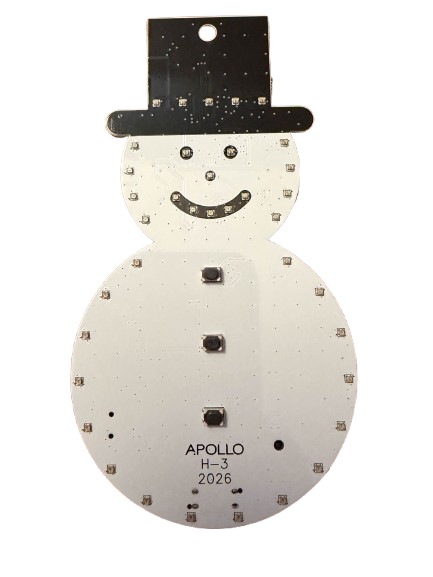

## Description

The Apollo H-3 is year three of the annual charity ornament series: a snowman-shaped PCB with 37 individually
addressable RGB LEDs and a piezo buzzer, built around an ESP32-C6. Every zone is separately controllable, so the
body, hat, mouth, eyes, and nose can each run their own colour or effect.

Three buttons on the front play holiday tunes with matching light shows. Each button carries two songs — a single
click and a double click (or hold) — for six preloaded tracks in total, and every song is editable from Home
Assistant as an RTTTL string.

**Features:**

- 37 addressable RGB LEDs across five independently controlled zones
- Body 24 LEDs, hat 5, mouth 5, eyes 2, nose 1
- Three buttons, six preloaded holiday tunes via the onboard buzzer
- Songs are editable at runtime as RTTTL text from Home Assistant
- USB-C or battery powered, with deep sleep and button wake for battery use
- Doubles as a Bluetooth proxy or Bluetooth tracker
- ESP32-C6 with 8MB flash

**All profits donated to:**

- **[CASA of Lexington](https://casaoflexington.org/)** - Advocates for children in the family court system who have
  experienced abuse or neglect, making sure their voices are heard.

- **[Open Home Foundation](https://www.openhomefoundation.org/)** - Apollo Automation is proud to back the Open Home
  Foundation. A portion of profits from every H-3 sold helps protect the values of privacy, choice, and
  sustainability in the smart home by supporting open source projects like Home Assistant and open connectivity
  standards.

## Quickstart

1. Power the H-3 over USB-C, or fit a battery.
2. Connect to "Apollo H3 Hotspot".
3. Input WiFi credentials.
4. In Home Assistant, look at discovered devices.

## Configuration

```yaml url=https://github.com/ApolloAutomation/H-3/blob/main/Integrations/ESPHome/H-3.yaml
```

## Links

- [Shop](https://apolloautomation.com/products/apollo-h-3-annual-holiday-ornament-for-charity)
- [GitHub](https://github.com/ApolloAutomation/H-3)
- [Wiki](https://wiki.apolloautomation.com/)
- [Discord](https://dsc.gg/ApolloAutomation)
- [YouTube](https://www.youtube.com/@ApolloAutomation)

## Product Images


