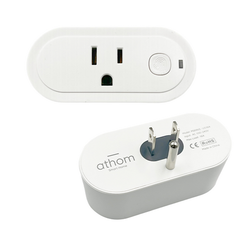

The same plug is sold as **IoTorero** and as **Athom** - IoTorero is a rebranding of Athom, and the hardware and
firmware are identical. Units labelled either way use the configuration below.

Maker: [https://www.athom.tech/](https://www.athom.tech/)
Product page: [https://www.athom.tech/blank-1/esp32-c3-us-plug-for-esphome](https://www.athom.tech/blank-1/esp32-c3-us-plug-for-esphome)

Also on Aliexpress, available pre-flashed with ESPHome or Tasmota.

## GPIO Pinout

| Pin    | Function   |
| ------ | ---------- |
| GPIO20 | CSE7766 Rx |
| GPIO3  | Button     |
| GPIO5  | Relay      |
| GPIO6  | Led        |

## Configuration

```yaml url=https://github.com/athom-tech/esp32-configs/blob/main/athom-smart-plug.yaml
```
