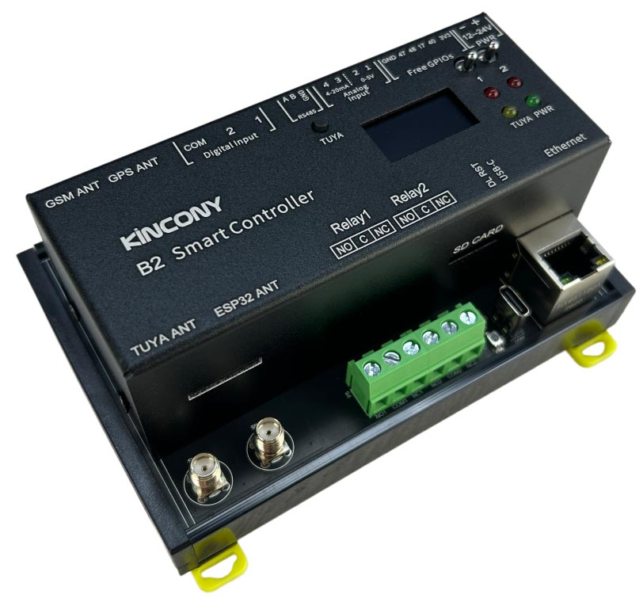

## Resources

- [ESP32 pin define details](https://www.kincony.com/forum/showthread.php?tid=9683)

## ESPHome Configuration

The basic configuration contains the KinCony B2 ESP32-S3 relay board's hardware definitions and core ESPHome components.

```yaml file=config.yaml
```

## Advanced Configuration

This configuration adds the onboard SSD1306 display example from the vendor configuration.

```yaml file=advanced.yaml
```
