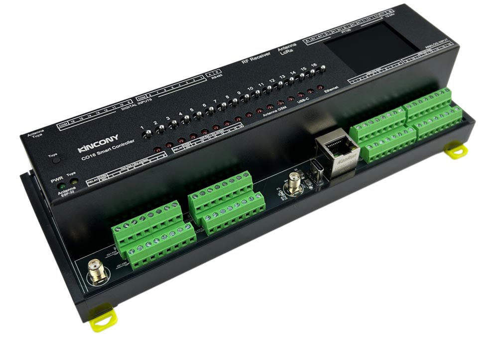

## Resources

- [ESP32 pin definition details](https://www.kincony.com/forum/showthread.php?tid=9778)

## ESPHome Configuration

Here is a hardware-only YAML configuration for the KinCony CO16 ESP32-S3 16-channel analog input board.

```yaml file=config.yaml
```

A complete configuration with Home Assistant API, OTA updates, relay outputs, analog inputs, and PT100 temperature
sensors:

```yaml file=advanced.yaml
```
