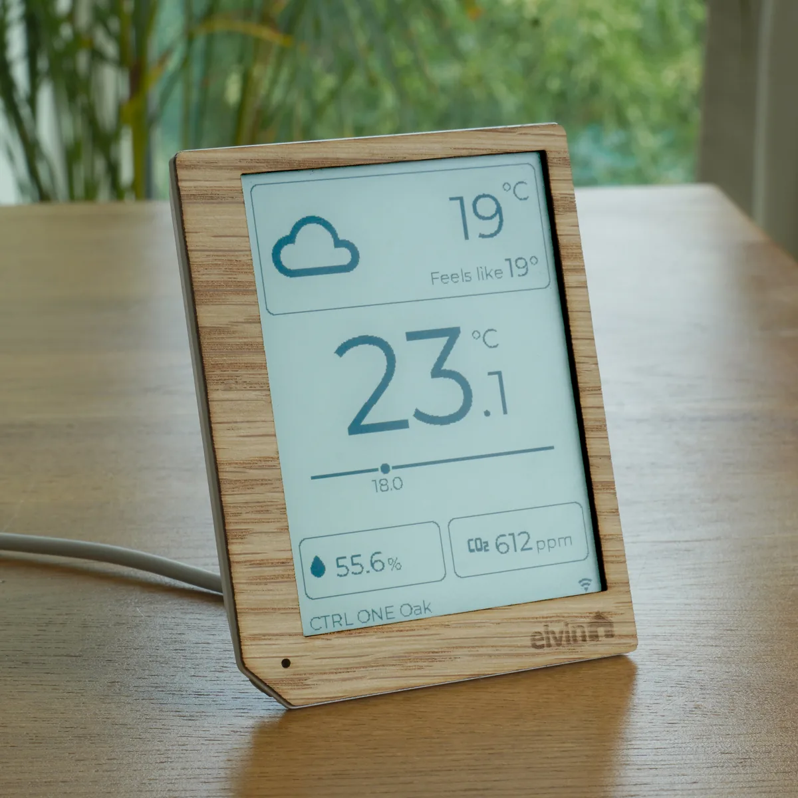
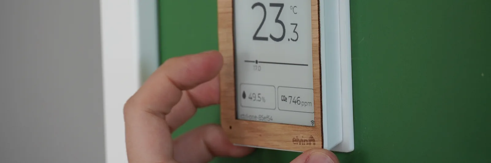
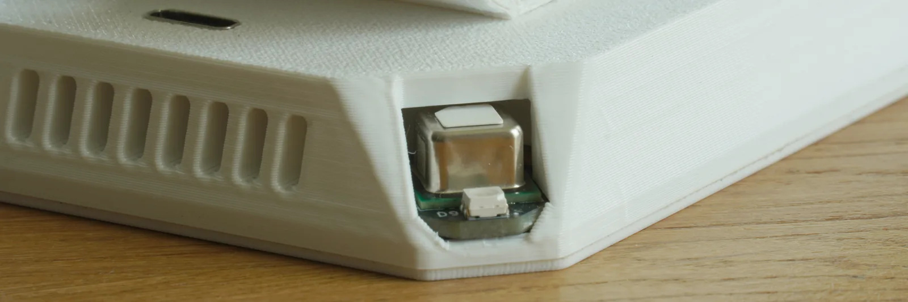
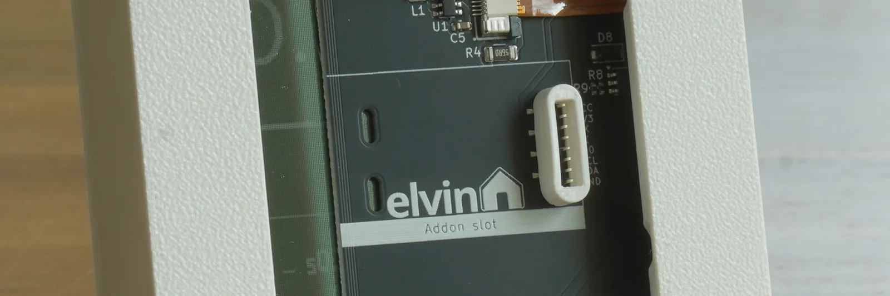

## Product Description

The CTRL ONE is a wall-mounted or desktop ePaper room controller built around the
Espressif ESP32-C6 (single-core RISC-V). It is a touch panel, information display
and air-quality monitor in one, with a flexible add-on system that turns it into
a fully-featured smart thermostat. It ships with ESPHome pre-flashed out of the
box.

The onboard Sensirion SCD40 sensor measures temperature, humidity and CO2.
The sensor sits in a corner cutout, separated from the heat-generating internals
and shielded from draughts and direct sunlight. It samples every 30 seconds by
default and is configurable down to every 5 seconds.

The 300 x 400 ePaper touchscreen supports partial refresh, along with a front light
(colloquially known as a backlight, but it is technically in front of the display layer).
The front-facing ambient light sensor is configured to automatically set the brightness.

The provided configuration creates a grid and widget system in LVGL. Out of the box, it
shows its own sensor readings; add widgets on a 4 x 6 grid to pull in Home
Assistant entities and control lights, fans, curtains and more with buttons and
sliders.

Key hardware:

- Espressif ESP32-C6 (RISC-V) with 2.4 GHz WiFi 6; Zigbee and Thread are possible
  through configuration changes.
- 4.2-inch ePaper display (Goodisplay GDEY042T81, 300 x 400 portrait) with
  touchscreen (FT63x6) and auto-dimming front light, driven over SPI.
- Sensirion SCD40 sensor measuring CO2, temperature and humidity over I2C.
- Ambient light sensor (ALS-PT19) on an ADC pin.
- Rear-facing RGB indicator LED.
- USB-C port for power and flashing (exposes the ESP32-C6 USB interface).
- 8-pin add-on connector on the back exposing GPIO, I2C, UART and power
  (up to 28 V), for the 24 VAC thermostat, buzzer and breakout add-ons.

The device is powered over USB-C or through the add-on slot.
It is available with a glossy-white acrylic or natural-oak bezel, and mounts to a
standard 60 mm European recessed wall box or sits on the included stand. The
enclosure is made of 3D-printed and laser-cut parts, with open-source mount and
bezel designs.

The firmware is GPLv3 licensed and hosted on
[Codeberg](https://codeberg.org/elvinhome/ctrl-one), targeting ESPHome 2026.7.0
or higher.

## GPIO Pinout

| Pin     | Function                                  |
| ------- | ----------------------------------------- |
| GPIO1   | Add-on connector general purpose pin      |
| GPIO2   | I2C SCL                                   |
| GPIO3   | I2C SDA                                   |
| GPIO4   | Touchscreen interrupt (FT63x6)            |
| GPIO5   | Touchscreen reset (FT63x6)                |
| GPIO6   | Ambient light ADC                         |
| GPIO7   | Screen front-light PWM (LEDC)             |
| GPIO8   | Indicator LED — red (inverted)            |
| GPIO14  | Indicator LED — blue (inverted)           |
| GPIO15  | Indicator LED — green (inverted)          |
| GPIO16  | Add-on connector — UART TX                |
| GPIO17  | Add-on connector — UART RX                |
| GPIO18  | SPI MOSI (display)                        |
| GPIO19  | SPI CLK (display)                         |
| GPIO20  | Display CS                                |
| GPIO21  | Display DC                                |
| GPIO22  | Display reset                             |
| GPIO23  | Display busy                              |

## Basic Configuration

This configuration is taken from the elvinhome [Codeberg repository](https://codeberg.org/elvinhome/ctrl-one).
For the source code of all sub-packages, check the repository.

```yaml url=https://codeberg.org/elvinhome/ctrl-one/src/branch/main/esphome/ctrl-one.yaml
```

## Notes

- The ePaper display uses the standard ESPHome `epaper_spi` platform
  (Goodisplay GDEY042T81). The touchscreen is the FT63x6 on the shared I2C bus.
- The add-on connector's relay output and buzzer both use GPIO1 (see the
  `addons/` folder in the firmware repository for the full add-on configs). The
  24 VAC thermostat add-on turns the device into a standalone thermostat that
  replaces common wired thermostats, powered by the heating system's own 24 V
  AC supply.
- The rear-facing notification LED is intended for short pulses only and not to
  be left permanently on. The heat from the light interferes with the temperature
  readings, so they are disabled while the light is on.

## Links

- [Product page](https://elvinhome.io/shop/ctrl-one-2)
- [Documentation](https://elvinhome.io/docs/ctrl-one)
- [Firmware and hardware source](https://codeberg.org/elvinhome/ctrl-one)
- [YouTube](https://www.youtube.com/@elvinhome-io)
- [Instagram](https://www.instagram.com/elvinhome.io/)
- [Reddit](https://www.reddit.com/r/elvinhome/)

## Product Images





