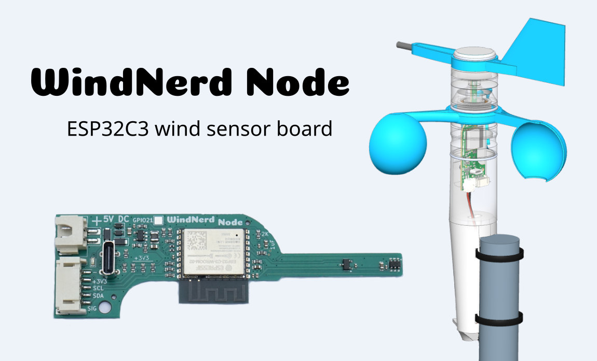

## Description

**WindNerd Node** is a sensor board designed for the open-source WindNerd 3D-printed anemometer.

With ESPHome pre-flashed, it provides a simple and efficient way to add live wind speed and direction to your Home
Assistant dashboard, after the satisfying job of assembling the parts you printed at home.

The **WindNerd Node** is also a tinkering and experimentation platform. An additional connector provides access to the
ESP32's I²C interface and an additional GPIO, for adding ESPHome compatible I²C sensors or other
hardware, like a rain gauge.

The board can therefore be used not only as a wind sensor, but also as the basis for a DIY personal weather station.

## Links

- Maker: [https://windnerd.net](https://windnerd.net)
- GitHub: [https://github.com/windnerd-labs/WindNerd-Node](https://github.com/windnerd-labs/WindNerd-Node)

## Configuration

```yaml url=https://github.com/windnerd-labs/WindNerd-Node/blob/main/example/esphome/factory.yaml
```
